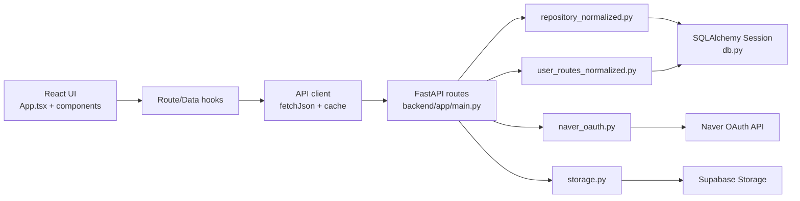
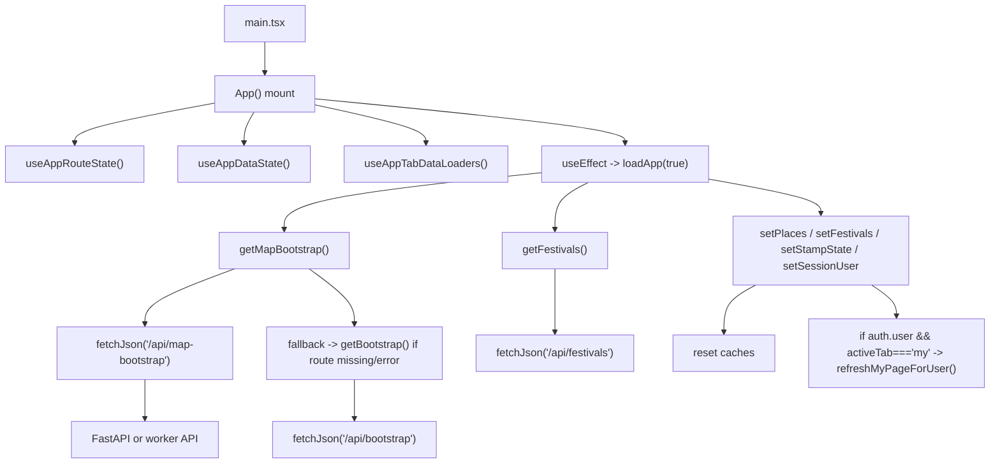
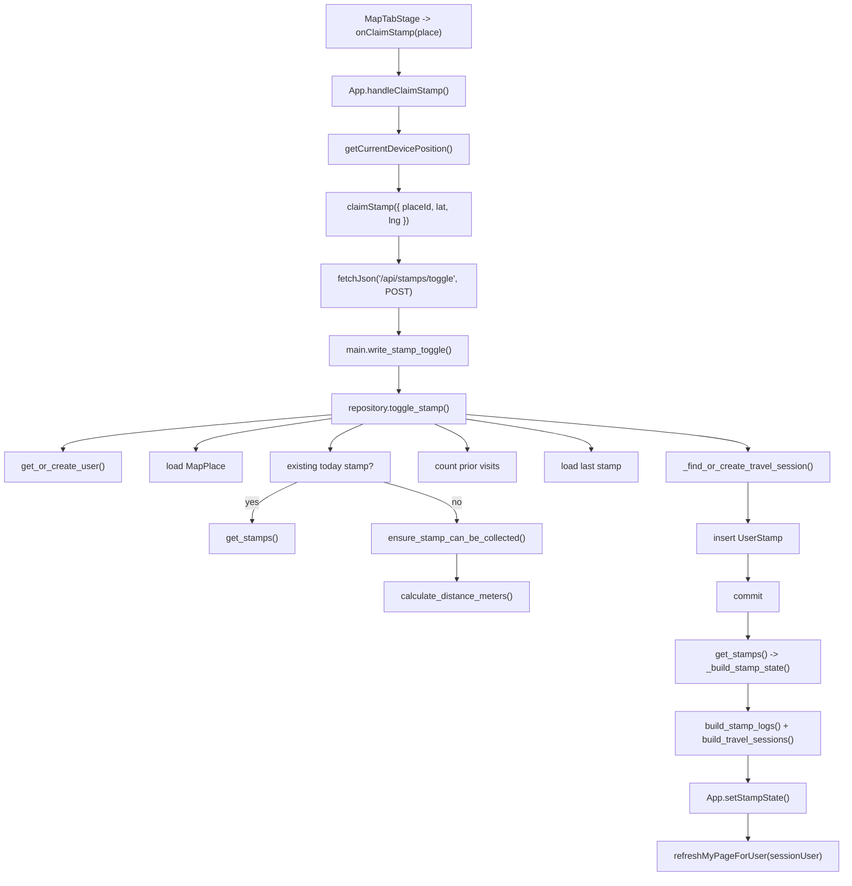
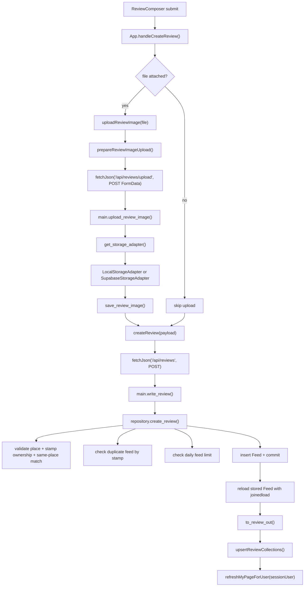
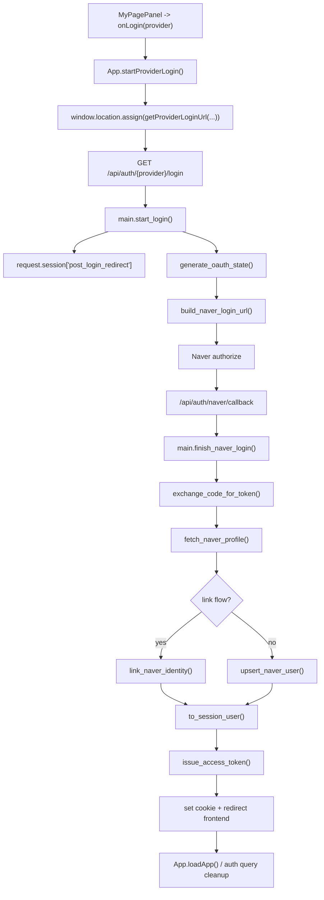
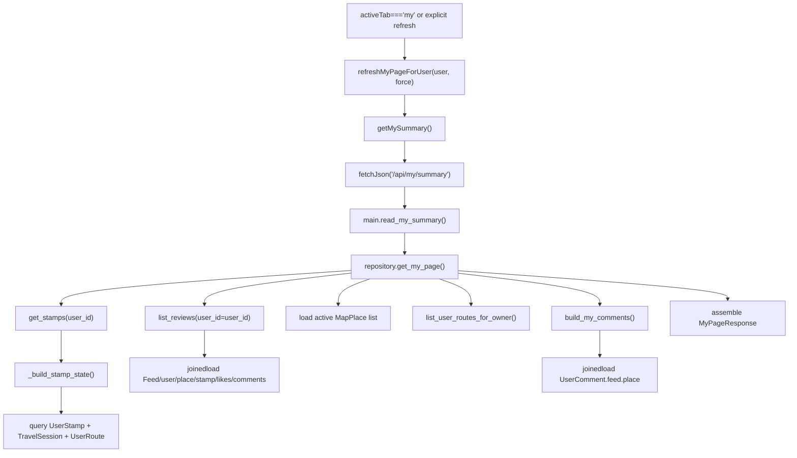
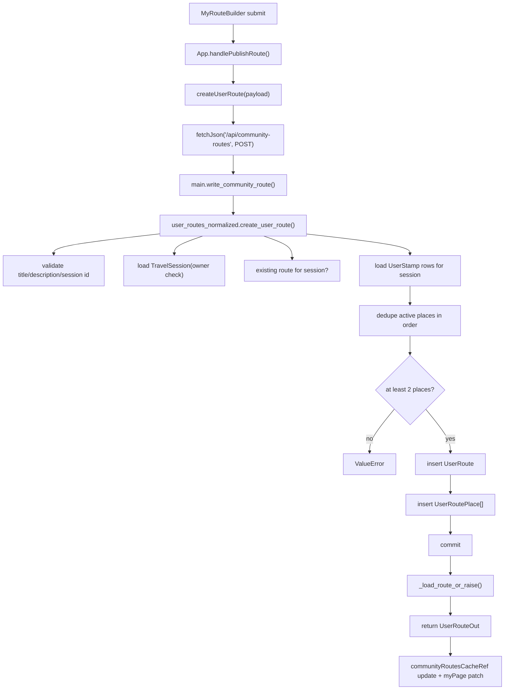

# Code Flow Diagrams

이 문서는 현재 저장소 기준으로 실제 호출 흐름을 따라가며 핵심 함수, 의존성, 병목 가능 지점을 기록한 것입니다.

기준 파일:
- `src/App.tsx`
- `src/api/client.ts`
- `src/hooks/useAppDataState.ts`
- `src/hooks/useAppTabDataLoaders.ts`
- `src/hooks/useAppRouteState.ts`
- `backend/app/main.py`
- `backend/app/repository_normalized.py`
- `backend/app/user_routes_normalized.py`
- `backend/app/storage.py`
- `backend/app/naver_oauth.py`
- `backend/app/db.py`

## 1. 시스템 의존 관계

핵심 의존성:
- 프론트 모든 사용자 플로우는 사실상 `App.tsx`가 조립한다.
- 네트워크 입구는 `src/api/client.ts`의 `fetchJson()` 하나로 수렴한다.
- 백엔드 비즈니스 규칙은 대부분 `repository_normalized.py`와 `user_routes_normalized.py`에 집중돼 있다.
- 인증은 브라우저 세션 쿠키, OAuth state, JWT 발급 흐름에 동시에 의존한다.
- 이미지 업로드는 DB가 아니라 `storage.py`를 통해 외부 스토리지로 직행한다.

## 2. 프론트 부트스트랩 플로우

관찰 포인트:
- 앱 첫 진입에서 지도, 축제, 인증 상태, 스탬프 상태를 한 번에 로드한다.
- `getMapBootstrap()`는 `/api/map-bootstrap` 실패 시 `/api/bootstrap`으로 폴백한다.
- 초기 로딩이 성공해도 이후 탭별 추가 로드는 `useAppTabDataLoaders()`가 따로 수행한다.

병목 후보:
- `App.tsx`가 라우팅, 데이터 적재, 낙관적 갱신, 오류 메시지, 화면 전환을 한 파일에서 모두 가진다.
- 초기 로딩이 실패하면 화면 복구 경로가 `loadApp()` 한 함수에 많이 묶여 있다.
- API 표면이 프론트 기대치와 다르면 폴백에 의존해 우회한다.

## 3. 스탬프 획득 플로우

핵심 의존성:
- 디바이스 위치 권한
- `MapPlace` 데이터 정합성
- `TravelSession` 규칙
- DB read-after-write 재조회

병목 후보:
- `toggle_stamp()`는 스탬프 생성 뒤 전체 `StampState`를 다시 빌드한다.
- `refreshMyPageForUser()`까지 이어져 스탬프 1회당 추가 집계 호출이 붙는다.
- 위치 확인 실패와 반경 검증 실패가 같은 사용자 액션 경로에 묶여 있다.

## 4. 리뷰 작성 플로우

핵심 의존성:
- 업로드 시 스토리지 가용성
- `UserStamp`와 `MapPlace`의 일치성
- 하루 1개 리뷰 규칙

병목 후보:
- 업로드와 리뷰 생성이 직렬이다. 파일이 있으면 체감 지연이 길어진다.
- `create_review()`는 commit 후 다시 join query로 재조회한다.
- 성공 후 프론트에서 다시 마이페이지를 전체 재로딩한다.

## 5. 네이버 로그인 및 계정 연결 플로우

핵심 의존성:
- 브라우저 세션 저장소
- Naver OAuth 외부 API
- 사용자/사용자 아이덴티티 테이블

병목 후보:
- 외부 API 왕복이 많고 실패면 전체 로그인 체감이 느려진다.
- `state`와 redirect 정보가 세션에 의존하므로 환경 설정이 어긋나면 디버깅이 어렵다.

## 6. 마이페이지 집계 플로우

핵심 의존성:
- `Feed`, `UserStamp`, `TravelSession`, `UserRoute`, `MapPlace`, `UserComment`
- 유저별 집계와 전체 활성 장소 집합

병목 후보:
- 가장 무거운 집계 지점이다. 리뷰, 스탬프, 세션, 코스, 댓글, 전체 장소를 한 요청에서 합친다.
- 스탬프 생성, 리뷰 작성, 댓글 수정/삭제 뒤 이 경로를 다시 자주 호출한다.
- 캐시가 프론트 메모리에만 있어 서버 집계 비용은 그대로 남는다.

## 7. 사용자 코스 발행 플로우

핵심 의존성:
- 이미 생성된 `TravelSession`
- 세션에 속한 `UserStamp` 순서
- 활성 장소만 포함한다는 규칙

병목 후보:
- 코스 생성도 commit 후 다시 `_load_route_or_raise()`로 재조회한다.
- 프론트가 성공 후 여러 캐시를 직접 갱신하므로 상태 일관성 버그가 생기기 쉽다.

## 8. 함수/클래스 단위 병목 정리

### 프론트

| 위치 | 역할 | 병목 또는 리스크 |
| --- | --- | --- |
| `src/App.tsx` | 앱 오케스트레이션 | 상태, 라우팅, 네트워크, 캐시 후처리가 한 파일에 과집중 |
| `src/api/client.ts::fetchJson` | 모든 API 호출 입구 | 폴백, 캐시, 오류 처리 책임이 한 함수에 몰림 |
| `src/hooks/useAppTabDataLoaders.ts::refreshMyPageForUser` | 마이페이지 리프레시 | 여러 사용자 액션 뒤 반복 호출되어 서버 집계 비용을 증폭 |
| `src/hooks/useAppDataState.ts` | 클라이언트 캐시 저장소 | 전역 상태와 캐시 무효화 규칙이 수동 관리됨 |

### 백엔드

| 위치 | 역할 | 병목 또는 리스크 |
| --- | --- | --- |
| `backend/app/main.py` | API routing | 라우트 수가 많고 비즈니스가 repository 함수에 강결합 |
| `backend/app/repository_normalized.py::get_my_page` | 종합 집계 | 가장 넓은 fan-in. 리뷰/스탬프/코스/댓글/장소를 모두 묶음 |
| `backend/app/repository_normalized.py::toggle_stamp` | 스탬프 생성 | 생성 후 전체 stamp state 재조회 |
| `backend/app/repository_normalized.py::create_review` | 리뷰 생성 | 검증 쿼리 다수 + commit 후 재조회 |
| `backend/app/user_routes_normalized.py::create_user_route` | 코스 생성 | 세션 스탬프 재조회 + commit 후 재조회 |
| `backend/app/storage.py::SupabaseStorageAdapter` | 이미지 업로드 | 외부 네트워크 I/O가 요청 동기 경로에 존재 |

## 9. 인터페이스 드리프트 메모

현재 프론트 API 클라이언트는 아래 경로를 기대하지만, `backend/app/main.py` 현재 스냅샷에서는 직접 구현이 보이지 않는다.

- `/api/map-bootstrap`
- `/api/review-feed`
- `/api/my/comments`
- `PATCH /api/reviews/{review_id}/comments/{comment_id}`
- `/api/discovery/search`
- `/api/discovery/recommendations`

해석:
- 이 경로들이 다른 Worker 레이어에서 제공될 수는 있다.
- 그러나 현재 저장소만 기준으로 보면 프론트 기대 API와 FastAPI 구현 사이에 드리프트가 있다.
- 따라서 “느림” 문제와 “없는 API를 우회하는 폴백” 문제를 구분해서 봐야 한다.

## 10. 우선 조사 추천 순서

1. `get_my_page()` 호출 빈도와 응답 시간을 먼저 측정한다.
2. `toggle_stamp()` 후 `get_stamps()`와 `refreshMyPageForUser()`가 중복 집계를 만드는지 확인한다.
3. `create_review()`에서 업로드 시간과 DB 재조회 시간을 분리 측정한다.
4. 프론트가 기대하는 API 표면과 실제 배포 Worker 표면을 맞춘다.
5. `App.tsx`의 오케스트레이션을 도메인별 훅으로 쪼갤 후보를 정리한다.
